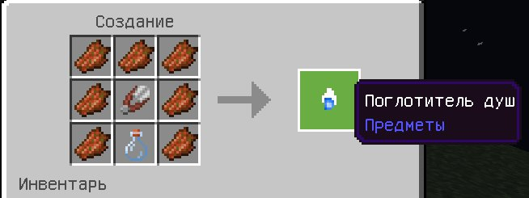
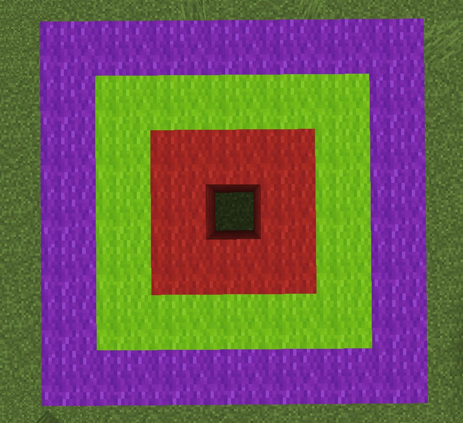
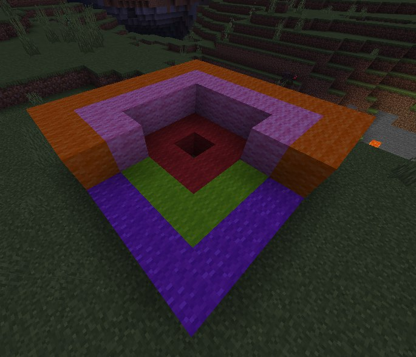
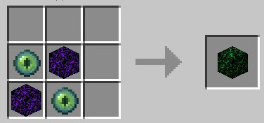
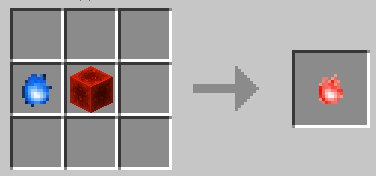

Чтобы использовать функциональность аддона вам нужно создать поглотитель душ. его крафт:

Теперь имея поглотитель душ в инвентаре вы можете убивать мобов и собирать их души. Они также как и костные блоки понадобятся вам дальше.

3 ряда вокруг центра. Красный - 1. Зелёный - 2. Фиолетовый - 3. Оранжевый - 4. Розовый - 5.

## Заклинания:
1, 2, 3, 4, 5 перед знаком "=" являются порядковым номером круга, цифра после "=" количеством костных блоков на ряду

челюсти, они атакуют мобов и игроков поблизости. 1=1, 2=1-5. Второй ряд указывает количество.

Молнии. 1=4, 2=1-3. Второй ряд указывает количество.

Тнт, призывает динамит у мобов и игроков поблизости. 1=8, 2=1-2. Второй ряд указывает количество.(Было временно убрано из аддона из-за чрезмерной разрушительности и не сбалансированности)

Разрушение блоков. 1=7, 2=1-6, 3=1-25. Второй ряд указывает направление, третий - длину тонеля

Огонь. 1=3, 2=1/2. Первый режим поджигает ближайших сущностей, второй тушит вас.

Эффекты. 1=5, 2=1-11, 3=1-25. Второй ряд указывает эффект, третий - силу эффекта.

Телепорт. 1=8, 2=1-9, 3=1-25, 4=1-25, 5=1-16. Второй ряд указывает направления, третий - расстояние по координате x, четвёртый - по координате z, пятый - по y.

Заморозка. 1=2, 2=1-2, 3=3-24/25. Второй ряд указывает тип, третий - в случае 25 блоков выставляет время в минуту, в случае 3-24 5 или 10 секунд в зависимости от типа.

Активатор. 1=1, 2=1-6, 3=0, 4=0, 5=1. Активирует два круга по указанному направлению во втором круге.

Магия проклятий. 1=6, 2=1-3, 3=1-15. Имеет три режима.

Телепорт предметов. 1=3, 2=1-10, 3=1-25, 4=1-25, 5=1-16. Второй ряд указывает направление или режим. Третий, четвертый и пятый работают так же как у телепорта.

Пометка/Возврат 1=8, 2=1/2, 3=25. 1 блок на втором ряду устанавливает пометку. 2 блока переносит к пометке.

Разрушение спавнеров. 1=4, 2=1/2, 3=25, 5=1. 1 блок на втором позволит разрушить и получить спавнер находящийся прямо над центром круга. 2 убъёто моба в центре круга и выдаст его яйцо призыва.

## Примечания и советы
В постройке кругов с первого по третий используются костные блоки.

В заклинаниях с использованием четвёртого и пятого рядов, на этих самых рядах используется новый блок - обсидиан края. его крафт:

Если на круге будут обнаружены эти блоки в соответстующих позициях, то будет использоваться другой набор заклинаний, круг после использования разрушен не будет.

Так же была добавлена душа редстоуна делается она из блока редстоуна и души. крафт: 

Дальше вам нужно переименовать её в координаты будушего блока в наковальне, координаты разделяются через пробел. Пример: 100 75 100.

После её размещения, на указанных координатах появится блок редстоуна.

Подробности по некоторым заклятьям посмотреть можно [тут](spellguide.md), но на самом деле я не советую, куда интереснее разбираться и эксперементировать самостоятельно

## Другое
Антимагический щит, крафтится из щита и Обсидиана края. После установки где-либо блокирует возможность использования кругов в радиусе 25 блоков от себя.

Переключатель ПВП. Если вы играете с друзьями и не хотите бить их заклинаниями вам нужно создать переключатель пвп. Крафтится из слитка золота и души. После его использования вы увидите надпись о включении/выключении пвп. Использовав повторно режим снова переключится. Обратите внимания, люди у которых включен пвп по прежнему смогут вас атаковать, а так же то что переключатель расходуется.
## Свитки.
Крафтятся из листа бумаги и души. После создания вам следует встать в центр круга и использовать его(не до конца, быстрое использование) после чего вы увидите количество блоков на разных рядах, а так же в описании предмета свитка будет продублирована данная информация. Для использования вам нужно зажать свиток до полного использования.

Внимание. Записывать можно любые круги, в которых используется только 3 ряда. К сожаления заклинания, позиционирующиеся от центра круга так же не будут работать из свитка(например пометка), но другие заклинания такие как, например, возврат чувствуют себя замечательно. Когда вы запишите свиток, вы увидите его название и количетсов блоков на слоях, над хотбаром с инструментами.

Для использования свитков, нужен опыт, в зависимости от количества блоков на 1 ряду количество опыта различается.

Если положить свиток в левую руку то зажав шифт его можно будет использовать, но это займёт чуть больше времени.

lumpackage=rpp
