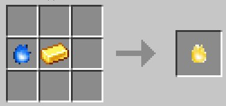

Чтобы использовать функциональность аддона вам нужно создать поглотитель душ. его крафт:

Теперь имея поглотитель душ в инвентаре вы можете убивать мобов и собирать их души. Они также как и костные блоки понадобятся вам дальше.

3 ряда вокруг центра. Красный - 1. Зелёный - 2. Фиолетовый - 3. Оранжевый - 4. Розовый - 5.

## Заклинания:
1, 2, 3, 4, 5 перед знаком "=" являются порядковым номером круга, цифра после "=" количеством костных блоков на ряду

челюсти, они атакуют мобов и игроков поблизости. 1=1, 2=1-5. Второй ряд указывает количество.

Молнии. 1=4, 2=1-3. Второй ряд указывает количество.

Тнт, призывает динамит у мобов и игроков поблизости. 1=8, 2=1-2. Второй ряд указывает количество.

Разрушение блоков. 1=7, 2=1-6, 3=1-25. Второй ряд указывает направление, третий - длину тонеля

Эффекты. 1=5, 2=1-9, 3=1-25. Второй ряд указывает эффект, третий - силу эффекта.

Телепорт. 1=8, 2=1-9, 3=1-25, 4=1-25, 5=1-16. Второй ряд указывает направления, третий - расстояние по координате x, четвёртый - по координате z, пятый - по y.

Заморозка. 1=2, 2=1-2, 3=3-24|25. Второй ряд указывает тип, третий - в случае 25 блоков выставляет время в минуту, в случае 3-24 5 или 10 секунд в зависимости от типа.

Активатор. 1=1, 2=1-6, 3=0, 4=0, 5=1. Активирует два круга по указанному направлению во втором круге.

## Примечания и советы
В заклинаниях с использованием четвёртого и пятого рядов, на этих самых рядах используется новый блок - обсидиан края. его крафт:

Если на круге будут обнаружены эти блоки в соответстующих позициях, то будет использоваться другой набор заклинаний, круг после использования разрушен не будет.

Так же была добавлена душа редстоуна делается она из блока редстоуна и души. крафт: 

После размещения её где-либо вы увидите сообщение в чате с её идентификатором. Таким идентификатором нужно назвать "душный активатор" и после его использования по любому твёрдому блоку, на месте души редстоуна появится блок редстоуна который может запитать что-либо. Например: раздатчик с душой внутри в центри круга для его удалённой активации.

Душный активатор крафтится из слитка золота и души. Крафт: 

Подробности по некоторым заклятьям посмотреть можно [тут](spellguide.md), но на самом деле я не советую, куда интереснее разбираться и эксперементировать самостоятельно
